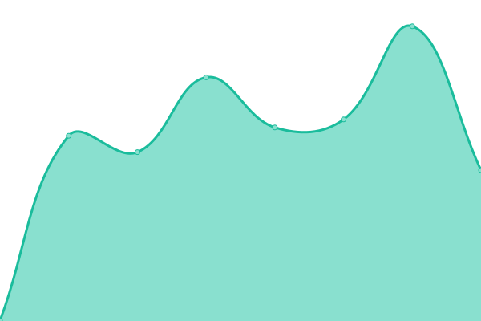
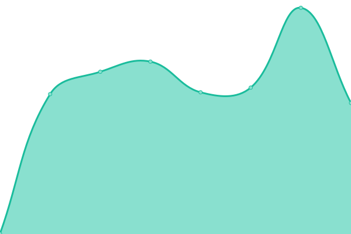

# [📈 Live Status](https://shomaru.github.io/upptime): <!--live status--> **🟩 All systems operational**

This repository contains the open-source uptime monitor and status page for [Upptime](https://upptime.js.org), powered by [Upptime](https://github.com/upptime/upptime).

With [Upptime](https://upptime.js.org), you can get your own unlimited and free uptime monitor and status page, powered entirely by a GitHub repository. We use [Issues](https://github.com/upptime/upptime/issues) as incident reports, [Actions](https://github.com/shomaru/upptime/actions) as uptime monitors, and [Pages](https://upptime.js.org) for the status page.

<!--start: status pages-->
<!-- This summary is generated by Upptime (https://github.com/upptime/upptime) -->
<!-- Do not edit this manually, your changes will be overwritten -->
<!-- prettier-ignore -->
| URL | Status | History | Response Time | Uptime |
| --- | ------ | ------- | ------------- | ------ |
|  [ACIC](https://aviationcharges.iata.org) | 🟩 Up | [acic.yml](https://github.com/shomaru/upptime/commits/HEAD/history/acic.yml) | 

 540ms
     
 | 

<a href="https://shomaru.github.io/upptime/history/acic">100.00%</a>
    

|  [SNAP](https://supplylink.iata.org) | 🟩 Up | [snap.yml](https://github.com/shomaru/upptime/commits/HEAD/history/snap.yml) | 

 616ms
     
 | 

<a href="https://shomaru.github.io/upptime/history/snap">100.00%</a>
    

|  [WebStar](https://webstar.iatan.org) | 🟩 Up | [web-star.yml](https://github.com/shomaru/upptime/commits/HEAD/history/web-star.yml) | 

 1007ms
     
 | 

<a href="https://shomaru.github.io/upptime/history/web-star">100.00%</a>
    

|  [PASS](https://pass.iata.org) | 🟩 Up | [pass.yml](https://github.com/shomaru/upptime/commits/HEAD/history/pass.yml) | 

 584ms
     
 | 

<a href="https://shomaru.github.io/upptime/history/pass">100.00%</a>
    

<!--end: status pages-->

[**Visit our status website →**](https://upptime.js.org)

## 📄 License

- Powered by: [Upptime](https://github.com/upptime/upptime)
- Code: [MIT](./LICENSE) © [Upptime](https://upptime.js.org)
- Data in the `./history` directory: [Open Database License](https://opendatacommons.org/licenses/odbl/1-0/)
